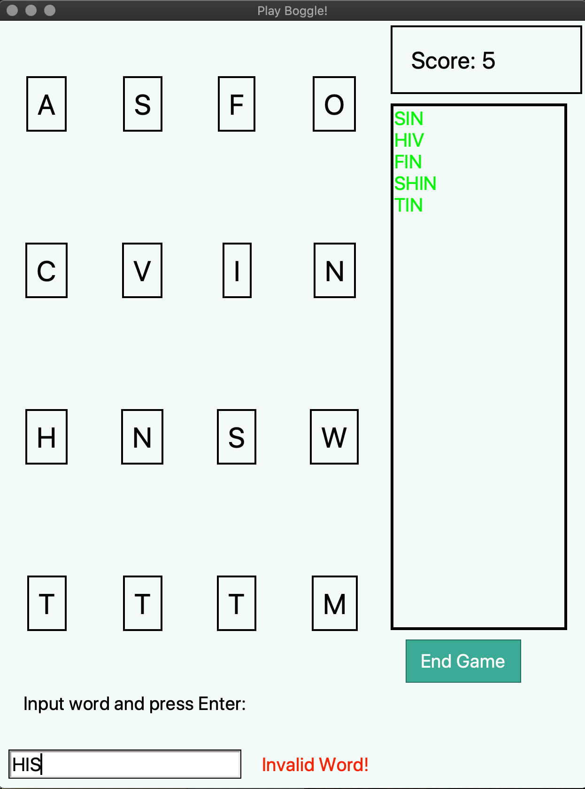

# boggle-game

An MVC implementation of boggle (game) using Python, Tkinter, and the pyenchant package for spell-checking. ( https://pypi.org/project/pyenchant/)

The game begins by shaking a covered tray of 16 cubic dice, each with a different letter printed on each of its sides.
The dice settle into a 4×4 tray so that only the top letter of each cube is visible. 

After they have settled into the grid, the player can guess try to form words through connected letters horizontally, vertically, and diagonally.
The longer the word, the more points the player gains. 

The game also features saving and loading funtionality so the user can save their game and continue at a later date. 





To play: 

Make sure you have installed:

* Install python 


* ```
  pip install pyenchant
  ```

